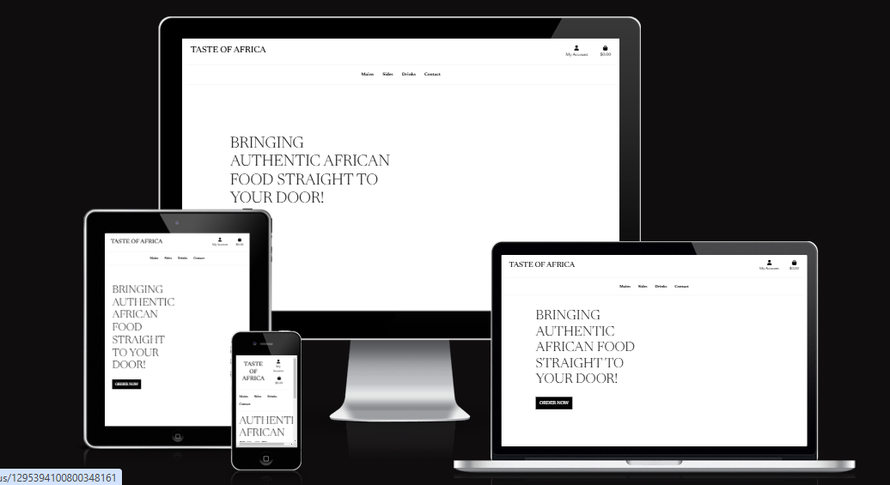
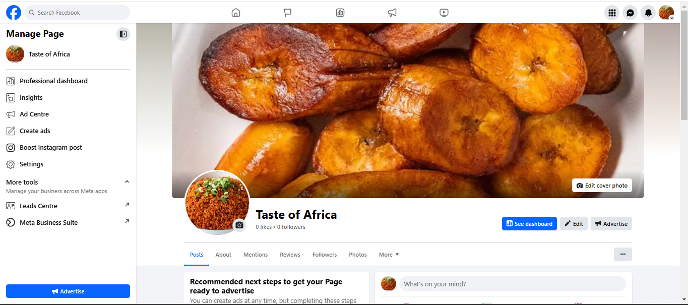
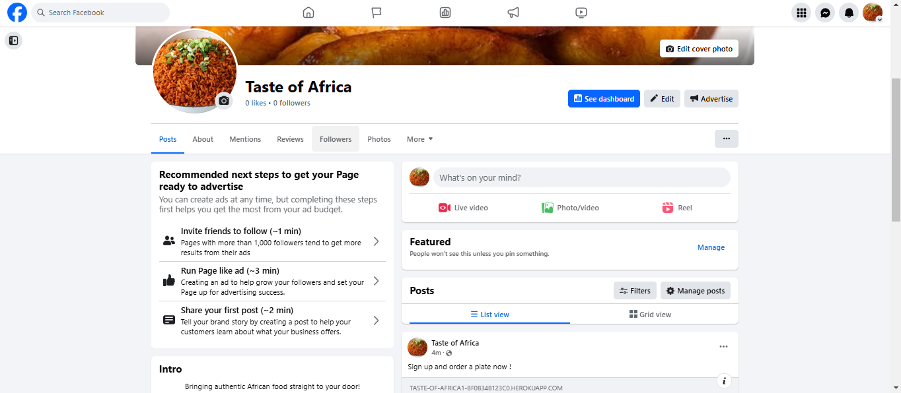
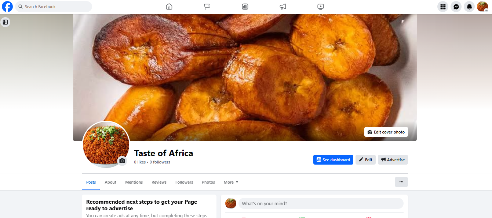

# Taste of Africa
## Introduction
This project is a fully functional e-commerce website where users can browse products, add them to a shopping bag, and complete purchases. The platform includes user authentication, a checkout system, and the ability to manage user profiles and orders.

You can view the live site here - [Taste of Africa](https://taste-of-africa1-bf0b34b123c0.herokuapp.com/)

# User Experience (UX)
## Target Audience
* Users who enjoy African dishes
* Users who enjoy exploring diverse cuisines and unique food experiences
* Users who need quick, convenient meal solutions delivered to their doorstep
* Users who may find grocery shopping or meal preparation challenging and require convenient, ready-to-eat meals

## Epics & User Stories
1. Epic - Viewing and Navigation
* [View a list of products](https://github.com/tee-24/Taste-of-Africa/issues/1)
* [View individual product details](https://github.com/tee-24/Taste-of-Africa/issues/3)
* [View cart total at any time](https://github.com/tee-24/Taste-of-Africa/issues/4)

2. Epic - Registration and User Accounts
* [User registration](https://github.com/tee-24/Taste-of-Africa/issues/5)
* [User login/logout](https://github.com/tee-24/Taste-of-Africa/issues/6)
* [Forgot password](https://github.com/tee-24/Taste-of-Africa/issues/7)
* [Email confirmation after registration](https://github.com/tee-24/Taste-of-Africa/issues/8)
* [User profile](https://github.com/tee-24/Taste-of-Africa/issues/9)

3. Epic - Sorting
* [Sort products](https://github.com/tee-24/Taste-of-Africa/issues/10)

4. Epic - Purchasing and Checkout
* [Select product quantity](https://github.com/tee-24/Taste-of-Africa/issues/11)
* [View and review cart before checkout](https://github.com/tee-24/Taste-of-Africa/issues/12)
* [Provide delivery information](https://github.com/tee-24/Taste-of-Africa/issues/13)
* [Provide payment information](https://github.com/tee-24/Taste-of-Africa/issues/14)
* [Order confirmation](https://github.com/tee-24/Taste-of-Africa/issues/15)

5. Epic - Admin and Store Management
* [Add products](https://github.com/tee-24/Taste-of-Africa/issues/16)
* [Edit products](https://github.com/tee-24/Taste-of-Africa/issues/17)
* [Delete products](https://github.com/tee-24/Taste-of-Africa/issues/18)

## App Aims
The primary aim of this e-commerce application is to provide users with a seamless shopping experience. The platform offers:

-   An extensive catalog of products with detailed descriptions.
    
-   A user-friendly shopping interface for quick and easy transactions.
    
-   Secure payment processing to ensure user trust.

-   Features such as favorites, reviews, and a contact form to enhance user satisfaction.
    
-   Tools for admins to manage products, orders, and user feedback effectively.

# Design
## Color Scheme
The final color scheme chosen was a simple black and white
* Edit link is blue
* Delete link is red
* Text is black

### Typography 
The font chosen was Newsreader

# Features

-   **User Authentication**: 
    -   Account registration.
    -   Login.       
    -   Manage profiles.

-   **Product Management**:
    -   Add new products to the store.
    -   Edit existing products.      
    -   Delete existing products.
    
 -   **Product Catalog Management**:
    -   View detailed product pages.       
    -   Add products to a shopping bag.
        
-   **Checkout Process**:   
    -   Secure payments using Stripe.        
    -   Order confirmation via email.
        
-   **Favorites**:   
    -   Users can save favorite products for later.
        
-   **Reviews**:    
    -   Users can submit product reviews and ratings.
        
-   **Contact Us**:    
    -   Submit inquiries via a contact form.
        
-   **Admin Features**:    
    -   Manage products, orders, and user feedback through the admin panel.

## Future Implementations
-   **Dynamic Recommendations**: Show users personalized product suggestions.
    
-   **Coupon System**: Add promotional discounts.
    
-   **Order Tracking**: Let users track their order status in real-time.

- **Mobile App Integration**: Develop a mobile application for easier access and ordering.

# Social Media Marketing
For the purposes of the assessment a Facebook page was created for the company. As a key foundation for any ecommerce website's marketing strategy social media would form a key part of the businesses marketing strategy. The page included links to the main website to drive traffic from the social network to the site. 

# Technologies Used
-   **Backend**: Python, Django Framework
    
-   **Frontend**: HTML, CSS, Bootstrap, JavaScript
    
-   **Database**: SQLite (development), PostgreSQL (production)
    
-   **Payment Integration**: Stripe
    
-   **Deployment**: Heroku
    
-   **Static Files**: AWS S3 Bucket (production), Django static files (development)

-    **Git**: Version control
    
-   **GitPod**: Online IDE for development
    
-   **GitBash**: Command-line interface for Git
    
-   **GitHub**: Code hosting

-   **Google Dev Tools**: Debugging and performance optimization
    
-   **Google Fonts**: Custom typography

# Deployment & Local Development
## Deployment
The app was deployed to Heroku via the following steps:
* Sign up / Log in to [Heroku](https://www.heroku.com/)
* From the main Heroku Dashboard page select 'New' and then 'Create New App'
* Give the project a unique name 
* Navigate to the setting tab, within the config vars section copy the DATABASE_URL to the clipboard for use in the Django configuration.
* Within the django app repository create a new file called env.py - within this file import the os library and set the environment variable for the DATABASE_URL pasting in the address copied from PostgreSQL. The line should appear as os.environ["DATABASE_URL"]= "Paste the link in here"
* Add a secret key to the app using os.environ["SECRET_KEY"] = "your secret key goes here"
* Add the secret key just created to the Heroku Config Vars as SECRET_KEY for the KEY value and the secret key value you created as the VALUE
* In the settings.py file within the django app, import Path from pathlib, import os and import dj_database_url
* insert the line if os.path.exists("env.py"): import env
* remove the insecure secret key that django has in the settings file and replace it with SECRET_KEY = os.environ.get('SECRET_KEY')
* replace the databases section with DATABASES = { 'default': dj_database_url.parse(os.environ.get("DATABASE_URL"))} ensure the correct indentation for python is used.
* In the terminal migrate the models over to the new database connection
* Navigate in a browser to Amazon AWS, log in, or create an account and log in. 
* Create a new S3 bucket for the site and create a static directory and media directory within the bucket.
* From the dashboard - copy the bucket details into the settings file.
    * you will require the following:
        - Storage Bucket Name
        - Storage Bucket Region Name
        - Access Key ID
        - Secret Access Key
    * configure these settings in the settings file
* in the env.py file created earlier 
    - add os.environ["AWS_ACCESS_KEY_ID"] = "paste in your access key"
    - add os.environ["AWS_SECRET_ACCESS_KEY"] = "paste in your secret access key"
* In Heroku, add the keys and values copied to the clipboard to the config vars
* Also add the KEY - DISABLE_COLLECTSTATIC with the Value - 1 to the config vars
* this key value pair must be removed prior to final deployment
* Using the requirements.txt file install all of the required packages
* in the Settings.py file - add the STATIC files settings - the url, storage path, directory path, root path, media url and default file storage path.
* Link the file to the templates directory in Heroku TEMPLATES_DIR = os.path.join(BASE_DIR, 'templates')
* Change the templates directory to TEMPLATES_DIR - 'DIRS': [TEMPLATES_DIR]
* Add Heroku to the ALLOWED_HOSTS list the format will be the app name given in Heroku when creating the app followed by .herokuapp.com
* In your code editor, create three new top level folders, media, static, templates
* Create a new file on the top level directory - Procfile
* Within the Procfile add the code - web: guincorn PROJECT_NAME.wsgi
* In the terminal, add the changed files, commit and push to GitHub
* In Heroku, navigate to the deployment tab and deploy the branch manually - watch the build logs for any errors.
* Heroku will now build the app for you. Once it has completed the build process you will see a 'Your App Was Successfully Deployed' message and a link to the app to visit the live site.
* This project utilises Stripe as a payment platform provider - You can create a stripe account at www.stripe.com you will need a developer account to gain access to the api keys required to run the payment processes.
* Once you have successfully created your stripe account, insert the stripe public key, stripe secret key and stripe webhook key into the env.py file and the heroku config vars. Configure the settings file to point at the variables required. Stripe provide documentation on how to setup stripe within django which is easy to follow. It is available within the stripe developer site.

## Local Development
### How to Fork
To fork the Taste of Africa repository:
1. Log in (or sign up) to Github
2. Go to the repository for this project
3. Click the Fork button in the top right corner

### How to Clone
To clone the Taste of Africa  repository:
1. Log in (or sign up) to Github
2. Go to the repository for this project
3. Click on the code button, select whether you would like to clone with HTTPS, SSH or GitHub CLI
4. Copy the link shown
5. Open the terminal in your code editor and change the current working directory to the location you want to use for the cloned directory
6. Type 'git clone' into the terminal 
7.  Paste the link you copied in step 3
8. Press enter

# Testing
Testing was ongoing throughout the entire build. I utilized Chrome developer tools while building to pinpoint and troubleshoot any issues as I went along.

### Code Institute Python Linter
Validation was done using [CI Python Linter](https://pep8ci.herokuapp.com/) 

### Manual Testing
To fully test my app, I performed the following tests:
| Test                                | Action                                                                                                                                   | Expected Result                                                                                                                                                                           | Pass/Fail |
| ----------------------------------- | ---------------------------------------------------------------------------------------------------------------------------------------- | ----------------------------------------------------------------------------------------------------------------------------------------------------------------------------------------- | --------- |
| Login                               | Click 'My Account' icon on top right of page Click 'Login' Fill out username/email and password                                    | Redirect to index page                                                                                                                                                                    | Pass      |
| Registration                        | Click 'My Account' icon on top right of page Click 'Register' Fill out email address, username and password                        | Send verification link to email                                                                                                                                                           | Pass      |
| Email verification                  | Click verification link in email Click confirm Fill out username/email and password                                                | Redirect to confirmation page Redirect to sign in page Redirect to index page                                                                                                       | Pass      |
| Logout                              | Click 'My Account' icon on top right of page Click 'Logout' Click sign out                                                         | Redirect to sign out page Redirect to index page                                                                                                                                       | Pass      |
| Favourites                          | Click 'My Account' icon on top right of page Click 'Favourites'                                                                       | Redirect to favourites page                                                                                                                                                               | Pass      |
| Logo                                | Click on the logo at the top left of the page                                                                                            | Redirect to index page                                                                                                                                                                    | Pass      |
| Navigation bar                      | Click on 'Mains' Click on 'Sides' Click on 'Drinks' Click on 'Contact'                                                          | Redirect to mains page Redirect to sides page Redirect to drinks page Redirect to Contact Us page                                                                                | Pass      |
| Sort                                | Click sort box \- Choose 'Price (low to high)' \- Choose 'Price (high to low)' \- Choose 'Name (A-Z)' \- Choose 'Name (Z-A)' | Sort items from lowest price to highest price Sort items from highst price to lowest price Sort items from according to name from A-Z Sort items from according to name from Z-A | Pass      |
| Product details                     | Click on a product                                                                                                                       | Redirect to product detail page                                                                                                                                                           | Pass      |
| Login to add to favourites button   |                                                                                                                                          |                                                                                                                                                                                           | Pass      |
| View favourites link                | On product detail page, click 'View Favourites' link                                                                                     | Redirect to favourites page                                                                                                                                                               | Pass      |
| Add to favourites button            | Click add to favourites button                                                                                                           | Button changes to 'remove from favourites'                                                                                                                                                | Fail      |
| Edit product                        | On product detail page, click 'Edit'                                                                                                     | Redirect to product management page                                                                                                                                                       | Pass      |
| Delete product                      | On product detail page, click 'Delete'                                                                                                   | Redirect to 'Mains' page                                                                                                                                                                  | Pass      |
| Add product                         | Click 'My Account' icon on top right of page Click 'Product Management' Enter product details Click 'Add Product'               | Redirect to product management page Redirect to product detail page                                                                                                                    | Pass      |
| Contact form                        | Click 'Contact' in navigation bar Fill out form Click 'Send Message'                                                               | Redirect to Contact Us page Message is received at bibistores24@gmail.com                                                                                                              | Pass      |
| Review                              | On product detail page, choose a rating, write a comment, and click 'submit review'                                                      | After admin approval, review is available under 'Customer Reviews' on product detail page                                                                                                 | Pass      |
| Quantity selector                   | On product detail page, click + On product detail page, click -                                                                       | Increase quantity of product to add to bag Decrease quantity of product to add to bag                                                                                                  | Pass      |
| Add to bag button                   | On product detail page, after choosing product quantity, click 'Add to bag' button                                                       | Add product to bag Display bag preview on the top right of the page Update bag total                                                                                                | Pass      |
| Keep shopping button (shopping bag) |                                                                                                                                          | Redirect to 'Mains' page                                                                                                                                                                  | Pass      |
| Checkout                            | Add items to cart Navigate to checkout Fill in required details                                                                    | Redirect to 'Order summary' page                                                                                                                                                          | Pass      |

# Bugs
### Known Bugs
The button to add an item to favorites should change from 'Add to Favorites' to 'Remove from Favorites' if the item has already been added to favorites

# Credits
* Fonts were sourced from [Google Fonts](https://fonts.google.com/)
 * Icons were sourced from [Font Awesome](https://fontawesome.com/)
 * Datasets were sourced from [Kaggle](https://www.kaggle.com/datasets/franklycypher/nigerian-foods)

# Acknowledgements
This app was designed and developed in conjunction with the Full Stack Software Developer Diploma course (ecommerce) at the Code Institute. I would like to thank my mentor, Matt, the Slack community, and Code Institute for all their support.